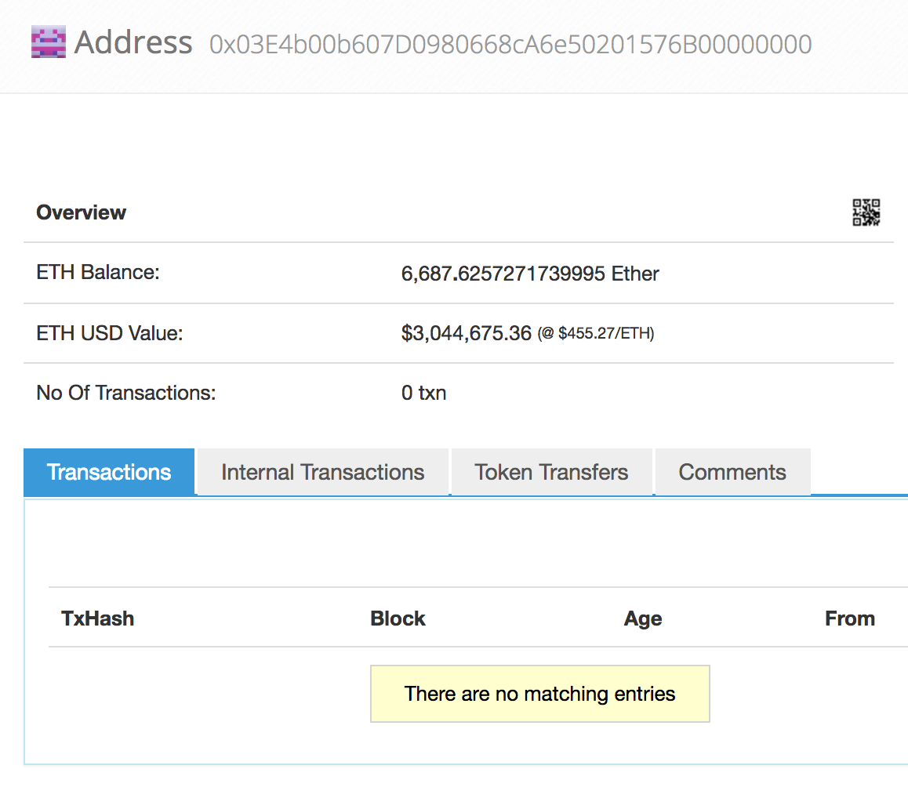

# Introduction to purescript-web3

### Martin Allen, FOAM

---

# plan of the talk

* ethereum
* purescript
* purescript-web3

---

## ethereum
- second most popupular blockchain and cryptocurrency
- turing-complete[^0] statemachine (EVM)
- allows consensus around execution of smart contracts

[^0]: Gas solves the non-termination problem

---


source: etherscan.io as of 12/2/2017

---


source: etherscan.io as of 12/2/2017

---


source: etherscan.io as of 12/2/2017

---

## solidity
- javascript like syntax
- special blockchain, crypto and signature-recovery primitives
- types for EVM primitives such as `uint48`
- interface through `ABI`

---

```javascript
contract GreedyStorage is owned {
  uint public m; // automatically generate getM()
  function increase (uint n) onlyOwner returns (uint) 
  {
     m = m + n;
     return m;
  }
  function override (uint n) payable 
  {
    require(msg.value > 100000);  // this is the price
    m = n;
    log0(bytes32(msg.sender));
  }
}
```

[edit on remix](https://ethereum.github.io/browser-solidity/#version=soljson-v0.4.19+commit.c4cbbb05.js&optimize=undefined&gist=a90b20b6df66c98f7af2f912952d2b7d)

---

```haskell
abi :: FunctionSignature -> ByteString
abi = take 8 $ sha3

> abi "increase(uint256)"
> "30f3f0db"
```

so for `GreedyStorage` we get

```json
{
    "30f3f0db": "increase(uint256)",
    "5a2ee019": "m()",
    "94d9e61c": "override(uint256)"
}
```

---

## typesafety (on-chain)
- work underway for strongly typed languages targeting EVM
- typesafe EVM language wouldn't necessarily have prevented infamous bugs. We'd need session types or similar.
- fundamental problem is `call()`-out from turingcomplete executable to turingcomplete executable. Types are not preserved on EVM.

---

## typesafety (off-chain)

Prevent catastrophes for

- encoding errors

---

> The token sale kicked off on schedule at 4:00pm UTC. About 20 minutes in, we realized something was awry with the contract transfer address. Whilst generating the contract bytes for deployment, a mistake was made defining the constructor parameters. Instead of a quoted string for an address, a Javascript hex string was used, i.e: “0x03e4B00B607d09811b0Fa61Cf636a6460861939F”
This resulted in an address in the byte code that looked very much like the actual address, but was not, i.e: “0x3e4b00b607d0980668ca6e50201576b00000000.” This address was incorrectly verified before deployment due to its similarities.

REX token sale (7/31/2017)

---



---

## typesafety (off-chain)

Prevent catastrophes for

- encoding errors
- migrations

---

```javascript
contract A {
  uint n;
  function A (uint _arg) {
    n = _arg;
  }
}
```

---

```javascript
contract A {
  int n;
  function A (int _arg) {
    n = _arg;
  }
}
```

---

## typesafety (off-chain)
Convenience

- CD/CI
- compile time errors

---
