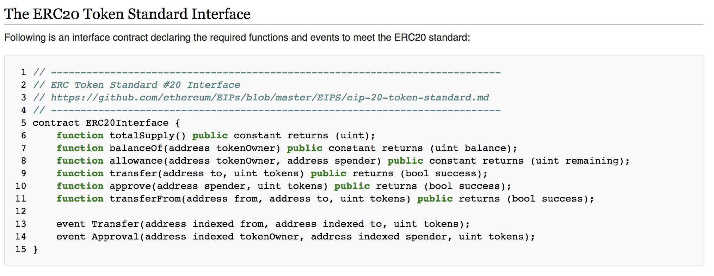

---

# Architecting an Ethereum App
---
<center>
  
## What does it look like?
<a href="https://raw.githubusercontent.com/f-o-a-m/recurse-presentation/master/images/foam-architecture.png">

</a>
</center>

---

## Auto-generated FFI

- Ethereum smart contracts expose an interface
- Example: ERC20 standard



---

## Auto-generated FFI

- Use the Application Binary Interface (ABI) as a specification

```json
 {
    "inputs": [
      {
        "name": "from",
        "type": "address"
      },
      {
        "name": "to",
        "type": "address"
      },
      {
        "name": "value",
        "type": "uint256"
      }
    ],
    "name": "transferFrom",
    ....
  }
...

```

---

## Auto-generated FFI

- Auto generate purescript or haskell code for FFI
<center>
<a href="https://github.com/f-o-a-m/recurse-presentation/blob/master/generated-docs/Contracts/Token.md">

</a>
</center>

---

## Functional Web3 Libraries
- [purescript-web3](https://github.com/f-o-a-m/purescript-web3): A web3 client library for purescript. Capable of generating client libraries for smart contracts from Solidity ABIs. Integrates with services like Metamask or uPort for in-browser transaction signing. Plays very nicely with Chanterelle.
- [hs-web3](https://github.com/airalab/hs-web3): A haskell web3 client library. Also capable of creating client libraries from ABIs using Template Haskell.

